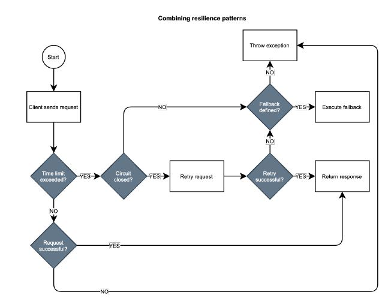

# STEPS TO FOLLOW FOR CLOUD DEVELOPMENT

1. Configure graceful shutdown and grace period for the application.
2. Add Spring Cloud Config Client to Order Service to make it fetch configuration data from Config Service.
3. Configure the Cloud Native Buildpacks integration, containerize the application, and define both CI and CD pipelines
4. Update your Docker Compose file to run the microservice as a container.
5. Write the Deployment and Service manifests for deploying the microservice to a Kubernetes cluster.
6. Update the commit stage of the deployment pipeline for the microservice to validate the Kubernetes manifests.
7. Configure Skaffold to automate the Order Service deployment to your local Kubernetes cluster initialized with kind.

# Deployment pipeline: Build and test

Continuous delivery is a holistic approach for quickly, reliably, and safely delivering software. The primary pattern for adopting such an approach is the deployment pipeline, which goes from code commit to releasable software. It should be automated as much as possible and represent the only path to production.
We can identify a few key stages in a deployment pipeline:

* **Commit stage**. After a developer commits new code to the mainline, this stage goes through build, unit tests, integration tests, static code analysis, and packaging. At the endof this stage, an executable application artifact is published to an artifact repository. That is a release candidate. For example, it can be a JAR artifact published to a Maven repository or a container image published to a container registry. This stage supports the continuous ntegration practice. It’s supposed to be fast, possibly under five minutes, to provide developers with fast feedback about their changes and allow them to move on to the next task.
* **Acceptance stage**. The publication of a new release candidate to the artifact repository triggers this stage, which consists of deploying the application to production-like environments and running additional tests to increase the confidence about its releasability. The tests running in the acceptance stage are usually slow, but we should
strive to keep the whole deployment pipeline execution under one hour. Examples of tests included in this stage are functional acceptance tests and non-functional acceptance tests, such as performance tests, security tests, and compliance tests. If necessary, this stage can also include manual tasks like exploratory and usability tests. At the end of this stage, the release candidate is ready to be deployed to production at any time. If we are still not confident about it, this stage is missing some tests.
* **Production stage**. After a release candidate has gone through the commit and acceptance stages, we are confident enough to deploy it to production. This stage is triggered manually or automatically, depending on whether it’s been decided to adopt a continuous deployment practice. The new release candidate is deployed to a production environment
using the same deployment scripts employed (and tested) in the acceptance stage. Optionally, some final automated tests can be run to verify the deployment was successful.

The vulnerability scanner we’ll use in the Polar Bookshop project is grype (github.com/anchore/grype), a powerful open-source tool increasingly used in the cloud native world. For example, it’s part of the security supply chain solution provided by the VMware Tanzu Application Platform.

Open a Terminal window and navigate to the root folder of your micro service project. Then, use grype to scan your Java codebase for vulnerabilities. The tool will download a list of known vulnerabilities (a vulnerability database)
and scan your project against them. The scanning happens locally on your machine, which means none of your files or artifacts is sent to an external service. That makes it a good fit for more regulated environments or air-gapped scenarios.

```
grype .
```

## Implementing the commit stage with GitHub Actions

# Testing a RESTful application with Spring

We write **unit tests** to verify the behavior of single application components in isolation, while **integration tests** to assert the overall functioning of different parts of an application interacting with each other.
In Spring, unit tests aren’t required to load the Spring application context and don’t rely on any Spring library. On the other hand, integration tests need a Spring application context to run.

## Integration tests with @SpringBootTest

A Spring Boot integration test can be initialized with a mock web environment or a running server.
Recent versions of Spring Framework and Spring Boot have extended the features for testing web applications. You can now use the **WebTestClient** class to test REST APIs both on mock environments and running servers.

## Testing REST controllers with @WebMvcTest

@WebMvcTest loads a Spring application context in a mock web environment (no running server), configures the Spring MVC infrastructure, and includes only the beans used by the MVC layer, like @RestController and @RestControllerAdvice. It’s a good idea to limit the context to the beans used by the specific controller under test. We can do so by providing the controller class as an argument to the @WebMvcTest annotation.

## Testing the JSON serialization with @JsonTest

Using the @JsonTest annotation, you can test JSON serialization and deserialization against an application context, including only configuration and beans needed for the purpose. The JacksonTester utility class lets you perform parsing operations using the Jackson library.

## Testing data persistence with Spring and Testcontainers

# Local Kubernetes development with Skaffold and Octant

These tools are used to set up a local Kubernetes development workflow to automate steps like building images and applying manifests to a Kubernetes cluster. It’s part of what is defined as the inner loop of working with a Kubernetes platform. Using Skaffold, you can focus on the business logic of your applications rather than on all those infrastructural concerns, and Octant is used to visualize and manage the Kubernetes objects through a convenient GUI.

# Defining a development workflow on Kubernetes with Skaffold

Skaffold is a tool developed by Google that "handles the workflow for building, pushing and deploying your application, allowing you to focus on what matters most: writing code". You can find instructions on how to install it on the official website: skaffold.dev. The goal is to design a workflow that will automate the following steps for you:

* packaging a Spring Boot application as a container image using Cloud Native Buildpacks;
* uploading the image to a Kubernetes cluster created with kind;
* creating all the Kubernetes objects described in the YAML manifests;
* enabling the port-forward functionality to access applications from your local computer;
* collecting the logs from the application and showing them in your console.

# Configuring Skaffold for building and deploying

You can initialize Skaffold in a new project using the skaffold init command and choosing a strategy for building the application. Navigate to the project root folder, and run the following command:

```
skaffold init --XXenableBuildpacksInit
```

The resulting configuration will be saved in a skaffold.yaml file created in your project root folder. If it doesn’t show up in your IDE, try refreshing the project. So far, we’ve been using the .yml extension for YAML files. To be consistent, go ahead and rename the Skaffold configuration file to skaffold.yml. The build part describes how you want to package the application. The deploy part specifies what you want to deploy.

# Deploying applications to K8 with Skaffold

The first option for running Skaffold is the development mode, which builds and deploys the objects you configured in skaffold.yml, and then starts watching the project source code. When something changes, it rolls out the updated objects in your local Kubernetes cluster automatically. In the project root folder:

```
skaffold dev --port-forward
```

The --port-forward flag will set up automatic port forwarding to your local machine. Information on which port is forwarded is printed out at the end of the task. Unless it’s not available, Skaffold will use the port you defined for the Service object. When you’re done working with the application, you can terminate the Skaffold process (Ctrl+C), and all the Kubernetes objects will get deleted automatically. Another option for running Skaffold is using the command. skaffold run. It works like the development mode, but it doesn’t provide live-reload nor clean up when it terminates. It’s typically used in a CI/CD pipeline.

## Event-driven applications and functions

Cloud native applications should be loosely coupled.
Event-driven architectures describe distributed systems that interact by producing and consuming
events. The interaction is asynchronous, solving the problem of temporal coupling.

## Event-driven architectures

When an event occurs, interested
parties can be notified. Event notification is usually done through messages, which are a data
representation of an event.

In an event-driven architecture, we identify event producers and event consumers. A producer is
a component detecting the event and sending a notification. A consumer is a component getting
notified when a specific event occurs. Producers and consumers don’t know each other and work
independently. A producer sends an event notification by publishing a message to a channel
operated by an event broker responsible for collecting and routing messages to consumers. A
consumer is notified by the broker when an event occurs and can act upon it.
Producers and consumers have minimal coupling when using a broker that takes the processing
and distribution of events on itself. In particular, they are temporally decoupled because the
interaction is asynchronous. Consumers can fetch and process messages at any time without affecting the producers whatsoever.

## Kafka With Java, Spring, and Docker — Asynchronous Communication Between Microservices

<https://github.com/pedroluiznogueira/medium-microservices-kafka>

The idea is to create a Producer Microservice that receives Food Orders to be created and pass them along to the Consumer Microservice through Kafka to be persisted in database.


### Kafka in a nutshell

A Kafka cluster is highly scalable and fault-tolerant, meaning that if any of its servers fails, the other servers will take over their work to ensure continuous operations without any data loss.

An event records the fact that something happened, carrying a message, that can be pretty much anything, for example, a string, an array or a JSON object. When you read or write data to Kafka, you do this in the form of those events.

Producers are those that publish (write) events to Kafka, and consumers are those that subscribe (read and process) these events.

Kafka uses a **binary protocol over TCP**. The protocol defines all APIs as request response message pairs. All messages are size delimited and are made up of the following primitive types.
The server guarantees that on a single TCP connection, requests will be processed in the order they are sent and responses will return in that order as well.
The benefits of this are:

* **Greater parallelism**. A Kafka client will typically open up TCP connections to multiple brokers in
  the cluster and send or fetch data in parallel across multiple partitions of the same topic.
* **Better network utilization** as HTTP headers can add a lot of size to otherwise small messages while
  Kafka’s wire protocol is a compact binary protocol.  
* **Kafka clients handle load balancing, failover, and cluster expansion or contraction automatically**
  while REST clients typically require a third party load balancer to achieve the same functionality.
* **Kafka client can send their own authentication credentials for access control and bandwidth throttling (quotas)** while all REST clients look to the kafka cluster as one Kafka client and therefore have common ACL privileges.
* **Kafka client libraries buffer and batch messages together into smaller numbers** of Kafka produce or
  fetch requests while HTTP can only batch data if the programmer thought to publish them as a single batch.
* **The native Kafka protocol supports more than just what the producer/consumer api exposes**. There is
  also an Admin API for creating topics, and modifying topic configurations. These functions are not (yet) exposed through the most popular REST Proxy implementations.

### Topics

Events are organized and durably stored in topics. A topic is similar to a folder, and these events are the files in that folder. Topics are multi-producer and multi-subscriber, meaning that we can have zero, one or many of them both.

**Events can be read as many times as needed, unlike traditional messaging systems, events are not deleted after consumption. Instead, you can define for how long Kafka should retain those events**.

### Partitions

Topics are partitioned, meaning that a topic is spread over a number of buckets. When a new event is published to a topic, it is actually appended to one of the topic’s partitions. Events with the same event key are written to the same partition. Kafka guarantees that any consumer of a given topic-partition will always read that partition’s events in the exact same order as they were written.


To make your data fault-tolerant and high-available, every topic can be replicated, even across regions or data centers, so that there are always multiple brokers that have a copy of the data just in case things go wrong (they will).

### Producer Microservice setup

* Spring Web
* Spring Boot Actuator
* Lombok
* Spring for Apache Kafka

### Consumer Microservice setup

* Spring Web
* Spring Boot Actuator
* Lombok
* Spring for Apache Kafka
* H2 Database
* Spring Data JPA

### Docker Environment for Kafka

Create a docker-compose.yml file, containing the required configurations to run Kafka, Kafdrop, and Zookeeper in Docker containers.

```
version: "3.7"

networks:
  kafka-net:
    name: kafka-net
    driver: bridge

services:
  zookeeper:
    image: zookeeper:3.7.0
    container_name: zookeeper
    restart: "no"
    networks:
      - kafka-net
    ports:
      - "2181:2181"

  kafka:
    image: obsidiandynamics/kafka
    container_name: kafka
    restart: "no"
    networks:
      - kafka-net
    ports:
      - "9092:9092"
    environment:
      KAFKA_LISTENER_SECURITY_PROTOCOL_MAP: DOCKER_INTERNAL:PLAINTEXT,DOCKER_EXTERNAL:PLAINTEXT
      KAFKA_LISTENERS: DOCKER_INTERNAL://:29092,DOCKER_EXTERNAL://:9092
      KAFKA_ADVERTISED_LISTENERS: DOCKER_INTERNAL://kafka:29092,DOCKER_EXTERNAL://${DOCKER_HOST_IP:-127.0.0.1}:9092
      KAFKA_INTER_BROKER_LISTENER_NAME: DOCKER_INTERNAL
      KAFKA_ZOOKEEPER_CONNECT: "zookeeper:2181"
      KAFKA_BROKER_ID: 1
      KAFKA_OFFSETS_TOPIC_REPLICATION_FACTOR: 1
    depends_on:
      - zookeeper

  kafdrop:
    image: obsidiandynamics/kafdrop
    container_name: kafdrop
    restart: "no"
    networks:
      - kafka-net
    ports:
      - "9000:9000"
    environment:
      KAFKA_BROKERCONNECT: "kafka:29092"
    depends_on:
      - "kafka"
```

You can access Kafdrop, which is a web interface for managing Kafka, in <http://localhost:9000>.


### Producer Microservice

Architecture:


Steps

* Create configuration beans
* Create a Food Order topic
* Create Food Order Controller, Service, and Producer
* Convert orders into messages in a string format to send to the broker

Environment variables and port to our API to run:

```
server:
  port: 8080

topic:
  name: t.food.order
```

**Config** — Responsible for creating the KafkaTemplate bean, which will be used to send the message, and creating the food order topic.

```
@Configuration
public class Config {

    private final KafkaProperties kafkaProperties;

    @Autowired
    public Config(KafkaProperties kafkaProperties) {
        this.kafkaProperties = kafkaProperties;
    }

    @Bean
    public ProducerFactory<String, String> producerFactory() {
        // get configs on application.properties/yml
        Map<String, Object> properties = kafkaProperties.buildProducerProperties();
        return new DefaultKafkaProducerFactory<>(properties);
    }

    @Bean
    public KafkaTemplate<String, String> kafkaTemplate() {
        return new KafkaTemplate<>(producerFactory());
    }

    @Bean
    public NewTopic topic() {
        return TopicBuilder
                .name("t.food.order")
                .partitions(1)
                .replicas(1)
                .build();
    }

}
```

Here’s the model class for FoodOrder:

```
@Data
@Value
public class FoodOrder {
    String item;
    Double amount;
}
```

**FoodOrderController** — Responsible for receiving a food order request, and passing it along to the service layer.

```
@Slf4j
@RestController
@RequestMapping("/order")
public class FoodOrderController {

    private final FoodOrderService foodOrderService;

    @Autowired
    public FoodOrderController(FoodOrderService foodOrderService) {
        this.foodOrderService = foodOrderService;
    }

    @PostMapping
    public String createFoodOrder(@RequestBody FoodOrder foodOrder) throws JsonProcessingException {
        log.info("create food order request received");
        return foodOrderService.createFoodOrder(foodOrder);
    }
}
```

**FoodOrderService** — Responsible for receiving the food order and passing it along to the producer.

```
@Slf4j
@Service
public class FoodOrderService {

    private final Producer producer;

    @Autowired
    public FoodOrderService(Producer producer) {
        this.producer = producer;
    }

    public String createFoodOrder(FoodOrder foodOrder) throws JsonProcessingException {
        return producer.sendMessage(foodOrder);
    }
}
```

**Producer** — Responsible for receiving the food order and publishing it as a message to Kafka.

In the **sendMessage()** method we convert the FoodOrder object into a string in JSON format, so it can be received as a string in the consumer microservice send the message, passing the topic in which to publish (referred as the environment variable **orderTopic**) and the order as a message.

```
@Slf4j
@Component
public class Producer {

    @Value("${topic.name}")
    private String orderTopic;

    private final ObjectMapper objectMapper;
    private final KafkaTemplate<String, String> kafkaTemplate;

    @Autowired
    public Producer(KafkaTemplate<String, String> kafkaTemplate, ObjectMapper objectMapper) {
        this.kafkaTemplate = kafkaTemplate;
        this.objectMapper = objectMapper;
    }

    public String sendMessage(FoodOrder foodOrder) throws JsonProcessingException {
        String orderAsMessage = objectMapper.writeValueAsString(foodOrder);
        kafkaTemplate.send(orderTopic, orderAsMessage);

        log.info("food order produced {}", orderAsMessage);

        return "message sent";
    }
}
```

When running the application, we should be able to see the topic created in Kafdrop. And when sending a food order, we should be able to see in the logs that the message was sent.


If under the Topics section in Kafdrop we access the t.food.order topic created, we should be able to see the message.


### Consumer Microservice

Architecture:


**Steps**

* Create a configuration for beans and group-id
* Create database access
* Create Food Order Consumer and Service
* Create a Food Access Repository

We will start configuring the port for our API to run, the topic to listen to, a group-id for our consumer, and the database configurations

```
server:
  port: 8081

topic:
  name: t.food.order

spring:
  kafka:
    consumer:
      group-id: "default"

  h2:
    console:
      enabled: true
      path: /h2-console
  datasource:
    url: jdbc:h2:mem:testdb
    username: sa
    password: password
```

**Config** — Responsible for configuring the ModelMapper bean which is a library used for mapping an object to another, when using the DTO pattern for example, that we will make use of here

```
@Configuration
public class Config {
    @Bean
    public ModelMapper modelMapper() {
        return new ModelMapper();
    }
}
```

The Model classes:

```
@Data
@Value
public class FoodOrderDto {
    String item;
    Double amount;
}

@Data
@Entity
@NoArgsConstructor
@AllArgsConstructor
public class FoodOrder {

    @Id @GeneratedValue(strategy = GenerationType.IDENTITY)
    private Long id;
    private String item;
    private Double amount;
}
```

**Consumer** — Responsible for listening to the food order topic and when any message is published to it, consume it. We will convert the listened messages to a FoodOrderDto object that doesn’t contain everything related to the entity that will be persisted, like the ID.

```
@Slf4j
@Component
public class Consumer {

    private static final String orderTopic = "${topic.name}";

    private final ObjectMapper objectMapper;
    private final FoodOrderService foodOrderService;

    @Autowired
    public Consumer(ObjectMapper objectMapper, FoodOrderService foodOrderService) {
        this.objectMapper = objectMapper;
        this.foodOrderService = foodOrderService;
    }

    @KafkaListener(topics = orderTopic)
    public void consumeMessage(String message) throws JsonProcessingException {
        log.info("message consumed {}", message);

        FoodOrderDto foodOrderDto = objectMapper.readValue(message, FoodOrderDto.class);
        foodOrderService.persistFoodOrder(foodOrderDto);
    }
}
```

**FoodOrderService** — Responsible for receiving the consumed order into a FoodOrder object to be and passing it along to the persistence layer to be persisted.

```
@Slf4j
@Service
public class FoodOrderService {

    private final FoodOrderRepository foodOrderRepository;
    private final ModelMapper modelMapper;

    @Autowired
    public FoodOrderService(FoodOrderRepository foodOrderRepository, ModelMapper modelMapper) {
        this.foodOrderRepository = foodOrderRepository;
        this.modelMapper = modelMapper;
    }

    public void persistFoodOrder(FoodOrderDto foodOrderDto) {
        FoodOrder foodOrder = modelMapper.map(foodOrderDto, FoodOrder.class);
        FoodOrder persistedFoodOrder = foodOrderRepository.save(foodOrder);

        log.info("food order persisted {}", persistedFoodOrder);
    }
}
```

The code for the **FoodOrderRepository** is:

```
@Repository
public interface FoodOrderRepository extends JpaRepository<FoodOrder, Long> {
}
```

Now only by running the Consumer Microservice, the already published messages will be consumed from the order topic


And an important detail to notice here is that if we go to Kafdrop and check the message that we just consumed, it will still be there. And that is something that wouldn’t happen with RabbitMQ, for example.


### Advanced features

We can send scheduled messages, by making use of Scheduling.

Enable it by adding the **@EnableScheduling** annotation in the configuration class in the Producer Microservice.

```
@EnableScheduling
@Configuration
public class Config {
    ...   
}
```

**Scheduler** is responsible for sending the messages at a certain rate, we will be sending them at a fixed rate of 1000 milliseconds.

```
@Slf4j
@Component
public class Scheduler {

    @Autowired
    private KafkaTemplate<String, String> kafkaTemplate;
    private Integer count = 0;

    @Scheduled(fixedRate = 1000)
    public void sendMessage() {
        count++;
        kafkaTemplate.send("t.scheduled", "message " + count);
        log.info("sent message count {}", count);
    }
}
```

The topic will be created automatically, but we could define the bean like we defined previously. The output would be:


# Kafka Streams with Spring Cloud Stream

## Introduction
Spring Cloud Stream, is a mechanism by which you can decouple the implementation of your producers and consumers from the type of messaging infrastructure you want to use. This allows us to keep our consumers and producers to be broker agnostic and we can easily switch to a different kind of broker by changing the binder implementation.

There are quite many binder implementations like e.g Kafka, RabbitMQ, AWS SNS, AWS SQS, etc. You can find a list of available binder implementations here.

Today we would be using the Kafka Binder to communicate with Kafka.

## Creating a Producer and Consumer
Let’s go to https://start.spring.io and create an application with the spring cloud streams dependency.

Once you generate the project, You will have to add the Kafka Binder dependency as follows:

```
<dependency>
  <groupId>org.springframework.cloud</groupId>
  <artifactId>spring-cloud-stream-binder-kafka</artifactId>
</dependency>
```

Now, to create a producer and consumer we only need to create beans with a supplier and a consumer as below.

```
@Bean
public Supplier<Message> producer() {
    return () -> new Message(" jack from Streams");
}

@Bean
public Consumer<Message> consumer() {
    return message -> System.out.println("received " + message);
}
```

That’s all. You just created a producer and a consumer. Now, this is a functional programming way to create a producer and a consumer to send and receive messages.

Now, let’s look at how to configure this to send and receive messages to and from the right destination. In our case, since we are using Kafka, the destination is a Kafka topic name.

```
spring:
  cloud:
    function:
      definition: consumer;producer
    stream:
      bindings:
        producer-out-0:
          destination: first-topic
        consumer-in-0:
          destination: first-topic
```

Since we used the functional programming way for defining the producer and the consumer, the binder names need to be of a particular format.

```
consumer : <functionName> + -in- + <index>
producer : <functionName> + -out- + <index>
```

Here the **in** refers to the consumer and **out** refers to the producer. The index is an index of the binder and is typically set to 0. You can read more about the binder naming convention here.

It's understandable that for a consumer, it just can be a consumer function definition, as it would be invoked when there is a message in the topic.

**But what about the producer which is the supplier function? Who invokes that?**
In this case, the supplier function is invoked by a default polling mechanism which is provided by the framework. It calls the supplier every second.

Now what about the case where you want to send a message after doing something. Probably you want to store your entity in the database and then send out an event. Let’s look at that next.

## Sending Messages on Demand

To send a message on-demand is pretty simple. We need to use StreamBridge , to send a message as follows.

```
@Component
public class KafkaProducer {

    @Autowired
    private StreamBridge streamBridge;

    @Scheduled(cron = "*/2 * * * * *")
    public void sendMessage(){
        streamBridge.send("producer-out-0",new Message(" jack from Stream bridge"));
    }
}
```

Here I have used the stream bridge to send messages, which is currently sending messages at an interval of 2 sec.

Now, Since we are using the Kafka binder, We need to provide properties to the binder in order to send messages to the right broker and also set the serializer and deserializer. Let's look at those configs.

## Kafka Binder Properties
Now to configure the Kafka binder to send to the right broker, We have set the broker properties as follows.

```
spring:
  cloud:
    function:
      definition: consumer;producer
    stream:
      kafka:
        binder:
          brokers: localhost:9092

      bindings:
        producer-out-0:
          destination: first-topic
  consumer-in-0:
    destination: first-topic
```

Now, since we are using a custom class to send and receive messages, We need to create a custom serializer and deserializer as follows.

```
public class MessageSerializer implements Serializer<Message> {

    private final ObjectMapper objectMapper = new ObjectMapper();

    @Override
    public byte[] serialize(String topic, Message data) {
        try {
            return objectMapper.writeValueAsBytes(data);
        } catch (JsonProcessingException e) {
            throw new SerializationException(e);
        }

    }
}

public class MessageDeSerializer implements Deserializer<Message> {

    private final ObjectMapper objectMapper = new ObjectMapper();

    @Override
    public Message deserialize(String topic, byte[] data) {
        try {
            return objectMapper.readValue(new String(data), Message.class);
        } catch (IOException e) {
            throw new SerializationException(e);
        }
    }
}
```

Next, we need to configure the Kafka binder to use the above serializer and deserializer.

```
spring:
  cloud:
    function:
      definition: consumer;producer
    stream:
      kafka:
        bindings:
          producer-out-0:
            producer:
              configuration:
                value.serializer: com.amrut.prabhu.dto.coverters.MessageSerializer
          consumer-in-0:
            consumer:
              configuration:
                value.deserializer: com.amrut.prabhu.dto.coverters.MessageDeSerializer
        binder:
          brokers: localhost:9092

      bindings:
        producer-out-0:
          destination: first-topic
          producer:
            useNativeEncoding: true # Enables using the custom serializer
        consumer-in-0:
          destination: first-topic
          consumer:
            use-native-decoding: true # Enables using the custom deserializer
```

To use custom serializers, we need to set **useNativeEncoding** to true. Then you can set the serializer and the deserializer classes for each of the bindings under the Kafka binder section as shown above.

You can find all supported properties that you provide to the Kafka binder in the **org.springframework.cloud .stream.binder.kafka.properties .KafkaBindingProperties** class.

With this let’s start the application with the following command.

```
java -jar \
target/spring-cloud-stream-kafka-communication-0.0.1-SNAPSHOT.jar
```

```{r, echo=FALSE}
# Define variable containing url
url <- "https://refactorfirst.com/static/images/2021/spring-cloud-stream-kafka/spring-cloud-stream-kafka-log.png?imwidth=1920"
```
## Some cat!
<center></center>

## Alternatively...


In the Logs, you can see the consumer is getting messages from the producer which we created using functional programming, and the producer which is using the stream bridge to send the messages.

# Ensuring disposability: Graceful shutdown

Gracefully shutting down means the application stops accepting new requests, completes all those still in progress, and closes any open resource like database connections.
By default, Spring Boot stops the server immediately after receiving a termination signal (SIGTERM). You can switch to a graceful mode by configuring SIGTERM the **server.shutdown** property.
You can also configure the **grace period**, which is how long the application is allowed to process all the pending requests. After the grace period expires, the application is terminated even if there are still pending requests. By default, the grace period is 30 seconds. You can change it through the **spring.lifecycle.timeout-per-shutdown-phase** property.
**application.yml**

```
server:
  port: 9001
  shutdown: graceful                    (1)
  tomcat:
    connection-timeout: 2s
    threads:
      max: 50
      min-spare: 5
spring:
  application:
    name: catalog-service
  lifecycle:
    timeout-per-shutdown-phase: 15s     (2)
```

(1) Enable graceful shutdown.
(2) Defines a 15s grace period.

## Configure a delay in Kubernetes before starting the graceful shutdown procedure (deployment.yml)

```
...
spec:
  containers:
    - name: catalog-service
      image: polarbookshop/catalog-service:0.0.1-SNAPSHOT
      imagePullPolicy: Always
      lifecycle:
        preStop:                                            (1)
          exec:
            command: [ "sh", "-c", "sleep 5" ]
```

(1) Makes Kubernetes wait 5 seconds before sending the SIGTERM signal to the Pod.

# Project Reactor: Reactive streams with Mono and Flux

Reactive streams work according to a producer/consumer paradigm. Producers are called **publishers**. They produce data that might be eventually available. Reactor provides publishers two central APIs implementing the Producer<T> interface for objects of type <T> and used to compose asynchronous, observable data streams: Mono<T> and Flux<T>.

* **Mono<T>** represents a single asynchronous value or empty result (0..1).
* **Flux<T>** represents an asynchronous sequence of zero or more items (0..N).

## Understanding the Spring reactive stack

The servlet stack is based on the Servlet API and a Servlet container (e.g., Tomcat). In contrast, the reactive model is based on the Reactive Streams API (implemented by Project Reactor) and either Netty or a Servlet container (version 3.1 as a minimum). Both stacks let you build RESTful applications using either classes annotated as @RestControlleror functional endpoints called Router Functions.
The servlet stack uses Spring MVC, while the reactive stack uses Spring WebFlux.

## MANAGING DATABASE SCHEMAS WITH FLYWAY

Spring Data R2DBC supports initializing data sources through **schema.sql** and **data.sql** files, just like Spring Data JDBC.
Flyway doesn’t support R2DBC yet, so you need to provide a JDBC driver to communicate with the database. The Flyway migration tasks are only run at application startup and in a single thread. Using a non-reactive communication approach for this one case doesn’t impact the overall application scalability and efficiency.

```
...
  r2dbc:
    username: ${DB_USERNAME:order_user}
    password: ${DB_PASSWORD:TXlzcWwzMjFPcmRlcg==}
    url: r2dbc:mysql://${DB_HOST:localhost}:3306/${DB_NAME:polardb_catalog}?useSSL=false&allowPublicKeyRetrieval=true
    pool:
      max-create-connection-time: 2s
      initial-size: 5
      max-size: 10
  flyway:
    user: ${spring.r2dbc.username}
    password: ${spring.r2dbc.password}
    url: ${FLYWAY_URI}
    table: order_service_flyway_schema_history
    baseline-on-migrate: true
    baseline-version: 0
    locations: classpath:mysqlmigrations
```

## Exposing a REST API with Spring WebFlux

There are two options for defining RESTful endpoints in a Spring WebFlux application: @RestController classes or functional beans (i.e., Router Functions).

### Reactive clients with Spring WebClient

**WebClient** is the modern alternative to **RestTemplate**. It provides blocking and non-blocking I/O, making it the perfect candidate for both imperative and reactive applications. It can be operated through a functional-style, fluent API that lets you configure any aspect of the HTTP interaction.

### Implementing REST clients with WebClient

1) **Configure a WebClient bean to call Catalog Service**

```
@Configuration
public class ClientConfig {
  @Bean
  WebClient webClient(ClientProperties clientProperties, 
      WebClient.Builder webClientBuilder) {                       (1)
    return webClientBuilder
      .baseUrl(clientProperties.catalogServiceUrl().toString())   (2)
      .build();
  }
}
```

(1) An object auto-configured by Spring Boot to build WebClient beans.
(2) Configures the WebClient base URL to the Catalog Service URL defined as a custom property.

2) Next, create a reactive REST client where you are going to use the WebClient bean to send HTTP calls to the
   endpoint exposed.

```
@Component
public class BookClient {
  private static final String BOOKS_ROOT_API = "/books/";   (1)
  private final WebClient webClient;

  public BookClient(WebClient webClient) {
    this.webClient = webClient;                             (2)
  }

  public Mono<Book> getBookByIsbn(String isbn) {
    return webClient
      .get()                                                (3)
      .uri(BOOKS_ROOT_API + isbn)                           (4)
      .retrieve()                                           (5)
      .bodyToMono(Book.class);                              (6)  
  }
}
```

(1) The root endpoint exposed by Catalog Service to manage books.
(2) A WebClient bean as configured previously.
(3) The request should use the GET method.
(4) The target URI of the request is /books/{isbn}.
(5) Sends the request and retrieves the response.
(6) Returns the retrieved object as "Mono<Book>".

### Resilient applications with Reactive Spring

The goal is to keep the system available without the user noticing. In the worst-case scenario, it could have degraded functionality, but it should still be available.
The integration point between the microservices will be done using Reactive Spring to configure timeouts, retries, and fallbacks.

#### Timeouts

Timeouts (also called ) are a simple, yet effective tool time limiters to preserve the responsiveness of your application in case a response is not received within a reasonable time period.
**Defining a timeout for WebClient**
Project Reactor provides a operator for defining a time limit timeout() for completing an operation. You can chain it with the result of the WebClient call to continue the reactive stream.

```
public Mono<Book> getBookByIsbn(String isbn) {
  return webClient.get().uri(isbn)
    .retrieve()
    .bodyToMono(Book.class)
    .timeout(Duration.ofSeconds(2));      (1)
}
```

(1) Sets a timeout for the GET request to 2 seconds.

Instead of throwing an exception when the timeout expires, you have the chance to provide a fallback behavior. Considering that Order Service can’t accept an order if the book availability is not verified, you might think of returning an empty result so that the order will be rejected. You can define a reactive empty result using Mono.empty().

```
public Mono<Book> getBookByIsbn(String isbn) {
  return webClient.get().uri(isbn)
    .retrieve()
    .bodyToMono(Book.class)
    .timeout(Duration.ofSeconds(2))   (1)
}
```

(1) Sets a timeout for the GET request to 2 seconds.

Instead of throwing an exception when the timeout expires, you have the chance to provide a fallback behavior. You
can define a reactive empty result using Mono.empty().

```
public Mono<Book> getBookByIsbn(String isbn) {
  return webClient.get().uri(isbn)
    .retrieve()
    .bodyToMono(Book.class)
    .timeout(Duration.ofSeconds(2), Mono.empty())   (1)
}
```

(1) The fallback returns an empty "Mono" object.

You should carefully design a time-limiting strategy for all the integration points in your system to meet your software SLAs and guarantee a good user experience.

#### Retries

When a service downstream doesn’t respond within a specific time limit or replies with a server error related to its momentary inability to process the request, you can configure your client to try it again.
A better approach is using an **exponential backoff** to perform each retry attempt with a growing delay. By waiting for more and more time between one attempt and the next, it’s more likely the backing service has had the time to recover and become responsive again. The strategy for computing the delay can be configured.
For instance: each retry attempt’s delay is computed as the number of attempts multiplied by 100ms (the initial backoff value).

##### DEFINING RETRIES FOR WEBCLIENT

Project Reactor provides a retryWhen() operator to retry an operation when it fails. **The position where you apply it to the reactive stream matters**.

* Placing the **retryWhen()** operator **after** timeout() means that the timeout is applied to each retry attempt.
* Placing the **retryWhen()** operator **before** timeout() means that the timeout is applied to the overall operation
  (that is, the whole sequence of initial request and retries has to happen within the given time limit).

```
public Mono<Book> getBookByIsbn(String isbn) {
  return webClient.get().uri(isbn)
    .retrieve()
    .bodyToMono(Book.class)
    .timeout(Duration.ofSeconds(2), Mono.empty())
    .retryWhen(Retry.backoff(3, Duration.ofMillis(100)));   (1)
}
```

(1) Exponential backoff is used as the retry strategy. 3 attempts allowed and 100ms initial backoff.  

##### UNDERSTANDING HOW TO USE RETRIES EFFECTIVELY

* Use them wisely.
* You shouldn’t retry non-idempotent requests, or you’ll risk generating inconsistent states.
* When retries are configured in a flow where the user is involved, remember to balance resilience and user experience.
  You don’t want users to wait too much while retrying the request behind the scenes. If you can’t avoid that, make sure you inform the users and give them feedback about the status of the request.

#### Fallbacks and error handling

A fallback behavior can help you limit the fault to a small area while preventing the rest of the system from misbehaving or entering a faulty state.
You want to include fallbacks into your general strategy to make your system resilient, not just for a specific case like timeouts. A fallback function can be triggered when some errors or exceptions occur, but they’re not all the same.

Project Reactor provides an operator **onErrorResume()** to define a fallback when a specific error occurs. You can add it to the reactive stream after the **timeout()** operator and before the **retryWhen()** so that if a 404 response is received, the retry operator is not triggered.

```
public Mono<Book> getBookByIsbn(String isbn) {
  return webClient.get().uri(isbn)
    .retrieve()
    .bodyToMono(Book.class)
    .timeout(Duration.ofSeconds(2), Mono.empty())
    .onErrorResume(WebClientResponseException.NotFound.class, exception -> Mono.empty())  (1)
    .retryWhen(Retry.backoff(3, Duration.ofMillis(100)));   
}
```

(1) Returns an empty object when a 404 response is received.

# API gateway and circuit breakers

* How to use Spring Cloud Gateway to build an Edge Service application, implement an API gateway, and some of those
  cross-cutting concerns.
* Improve the resilience of the system by configuring circuit breakers with Spring Cloud Circuit Breaker, defining rate
  limiters with Spring Data Redis Reactive, and using retries and timeouts.
* How to store the web session state using Spring Session Redis, a NoSQL, in-memory data store.
* How to manage external access to the applications running in a Kubernetes cluster relying on the Kubernetes Ingress
  API.

Adding Edge Service to the system lets you define an API gateway to decouple the internal services from its external clients and provides you with a central place to implement cross-cutting concerns like authentication and authorization, monitoring, and resilience.

Spring Cloud Gateway greatly simplifies building edge services, focusing on simplicity and productivity. Furthermore, since it’s based on a reactive stack, it can scale efficiently to handle the high workload naturally happening at the edge of a system.

```
server:
  port: 9000
  netty:
    connection-timeout: 2s
  shutdown: graceful

spring:
  application:
    name: edge-service
  lifecycle:
    timeout-per-shutdown-phase: 15s
```

## Defining routes and predicates

Spring Cloud Gateway provides three main building blocks:

* **Route**. It’s identified by a unique ID, a collection of predicates deciding whether to follow the route, a URI for
  forwarding the request if the predicates allow, and a collection of filters applied either before or after forwarding the request downstream.
* **Predicate**. It matches anything from the HTTP request, including path, host, headers, query parameters, cookies,
  and body.
* **Filter**. It modifies an HTTP request or response before or after forwarding the request to the downstream service.

```
...
spring:
  cloud:
    gateway:
      routes:                                                         (1)
        - id: catalog-route                                           (2)
          uri: ${CATALOG_SERVICE_URL:http://localhost:9001}/books
          predicates:
            - Path=/books/**                                          (3)
        - id: order-route
          uri: ${ORDER_SERVICE_URL:http://localhost:9002}/orders      (4)
          predicates:
            - Path=/orders/**
```

(1) A list of route definitions.
(2) The route ID.
(3) The predicate is a path to match.
(4) The URI value comes from an environment variable, or else the default.

## Processing requests and responses through filters

Routes and predicates alone make the application act as a proxy, but filters make Spring Cloud Gateway really powerful. Filters can run before forwarding incoming requests to a downstream application (**pre-filters**). For example, they’re used for:

* manipulating the request headers;
* applying rate limiting and circuit breaking;
* defining retries and timeouts for the proxied request;
* triggering an authentication flow with OAuth2 and OpenID Connect.

Other filters can apply to outgoing responses before sending them back to the client and after being received from the downstream application (post-filters). For example, they’re used for:

* setting security headers;
* manipulating the response body to remove sensitive information.

Spring Cloud Gateway comes bundled with many filters that you can use to perform different actions, including adding headers to a request, configuring a circuit breaker, saving the web session, retrying the request on failure, or activating a rate limiter.

### USING THE RETRY FILTER

You should use
a backoff strategy instead. By default, the delay is computed using the formula **firstBackoff * (factor ^ n)**. If you set the **basedOnPreviousValue** parameter to **true**, the formula will be **prevBackoff * factor**.

```
spring:
  cloud:
    gateway:
      default-filters:                                                                  (1)
        - name: Retry                                                                   (2)
          args:
            retries: 3                                                                  (3)  
            methods: GET                                                                (4)
            series: SERVER_ERROR                                                        (5)
            exceptions: java.io.IOException, java.util.concurrent.TimeoutException      (6)
            backoff:                                                                    (7)  
              firstBackoff: 50ms
              maxBackoff: 500ms
              factor: 2
              basedOnPreviousValue: false
```

(1) A list of default filters.
(2) The name of the filter.
(3) Maximum of 3 retry attempts.
(4) Retries only GET requests.
(5) Retries only when 5xx errors.
(6) Retries only when the given exceptions are thrown.
(7) Retries with a delay computed as "firstBackoff * (factor ^ n)".

**The retry pattern is useful when a downstream service is momentarily unavailable.**

## Fault tolerance with Spring Cloud Circuit Breaker and Resilience4J

The Spring Cloud Circuit Breaker project provides an abstraction for defining circuit breakers in a Spring application. Resilience4J became the preferred choice because it provides the same features offered by Hystrix and more.

### Introducing circuit breakers with Spring Cloud Circuit Breaker

**pom.xml**:
org.springframework.cloud:spring-cloud-starter-circuitbreaker-reactor-resilience4

The **CircuitBreaker** filter in Spring Cloud Gateway relies on Spring Cloud CircuitBreaker Circuit Breaker to wrap a route. Being a **GatewayFilter**, you can apply it to specific routes or define it as a default filter. You can also specify an optional fallback URI to forward the request when the circuit is in an open state.

```
'''
spring:
  cloud:
    gateway:
      routes:
        - id: catalog-route
          uri: ${CATALOG_SERVICE_URL:http://localhost:9001}/books
          predicates:
            - Path=/books/**
          filters:
            - name: CircuitBreaker                                      (1)
              args:
                name: catalogCircuitBreaker                             (2)
                fallbackUri: forward:/catalog-fallback                  (3)
        - id: order-route
          uri: ${ORDER_SERVICE_URL:http://localhost:9002}/orders
          predicates:
            - Path=/orders/**
          filters:
            - name: CircuitBreaker                                      (4)
              args:
                name: orderCiruitBreaker
```

(1) Name of the filter.
(2) Name of the circuit breaker.
(3) Forwards request to this URI when the circuit is open.
(4) No fallback defined for this circuit breaker.

### Configuring a circuit breaker with Resilience4J

Yyou need to configure the circuit breakers themselves.
You can configure circuit breakers through the properties provided by Resilience4J or via a **Customizer** bean. Since we’re using the reactive version of Resilience4J, it would be a **Customizer<ReactiveResilience4JCircuitBreakerFactory>**.
For example, we can define circuit breakers to consider a window of 20 calls (**slidingWindowSize**). Each new call will make the window move, dropping the oldest registered call. When at least 50% of the calls in the window produced an error (**failureRateThreshold**), the circuit breaker trips, and the circuit enters the open state. After 15 seconds (**waitDurationInOpenState**), the circuit is allowed to transition to a half-open state in which 5 calls are permitted (**permittedNumberOfCallsInHalfOpenState**). If at least 50% of them result in an error, the circuit will go back to the open state. Otherwise, the circuit breaker trips to the close state.

```
resilience4j:
  circuitbreaker:
    configs:
      default:                                      (1)
        slidingWindowsSize: 20                      (2)
        failureRateThreshold: 50                    (3)
        waitDurationInOpenState: 15000              (4)
        permittedNumberOfCallsInHalfOpenState: 5    (5)
  timelimiter:
    configs:
      default:                                      (6)
        timeoutDuration: 5s                         (7)
```

(1) Default configuration bean for all circuit breakers.
(2) The size of the sliding window used to record the outcome of calls when the circuit is closed.
(3) When the failure rate is above the threshold, the circuit becomes open.
(4) Waiting time before moving from open to half-open (ms).
(5) Number of permitted calls when the circuit is half-open.
(6) Default configuration bean for all time limiters.
(7) Configures a timeout (seconds).

We configure both the circuit breaker and a time limiter, a required component when using the Resilience4J implementation of Spring Cloud Circuit Breaker. The timeout configured via Resilience4J will take precedence over the response timeout for the Netty HTTP client (**spring.cloud.gateway.httpclient.response-timeout**).

### Defining fallback REST APIs with Spring WebFlux

WebFlux supports defining REST endpoints both using @RestController classes and Router Functions. Let’s use the functional way for declaring the fallback endpoints.
Functional endpoints in Spring WebFlux are defined as routes in a **RouterFunction<ServerResponse>** bean, using the fluent API provided by **RouterFunctions**. For each route, you need to define the endpoint URL, a method, and a handler.

```
@Configuration
public class WebEndpoints {

    @Bean                                                                                   (1)
    public RouterFunction<ServerResponse> routerFunction() {
        return RouterFunctions.route()                                                      (2)
                .GET("/catalog-fallback", request ->                                        (3)
                        ServerResponse.ok()
                                .body(Mono.just(""), String.class))
                .POST("/catalog-fallback", request ->                                       (4)
                        ServerResponse.status(HttpStatus.SERVICE_UNAVAILABLE).build())
                .build();                                                                   (5)
    }
}
```

(1) Functional REST endpoints are defined in a bean.
(2) Offers a fluent API to build routes.
(3) Fallback response used to handle the GET endpoint.
(4) Fallback response used to handle the POST endpoint.
(5) Builds the functional endpoints.

In a real scenario, you might want to adopt different fallback strategies depending on the context, including throwing a custom exception to be handled from the client or returning the last value saved in cache for the original request.

### Combining circuit breakers, retries, and time limiters

When you combine multiple resilience patterns, the sequence in which they are applied is fundamental. Spring Cloud Gateway takes care of applying the **TimeLimiter** first (or the timeout on the HTTP client), then the **CircuitBreaker** filter, and finally **Retry**.


You can verify the result of applying these patterns to Edge Service using a tool like Apache Benchmark (httpd.apache.org/docs/2.4/programs/ab.html).
Make sure microservices are not running. Then, enable debug logging for Resilience4J to follow the state transitions of the circuit breaker. At the end of your application.yml file, add the following configuration.

```
logging:
  level:
    io.github.resilience4j: DEBUG
```

Next, build and run Edge Service. Since all downstream services are not running (if they are, you should stop them), all the requests sent to them from Edge Service will  result in an error.

```
ab -n 21 -c 1 -m POST http://localhost:9000/orders
```

The circuit breaker is configured to trip to the open state when at least 50% of the calls in a 20-sized time window fails. Since you have just started the application, the circuit will transition to the open state after 20 requests. In the application logs, you can analyze how the requests have been handled. All requests fail, so the circuit breaker registers an ERROR event.

```
No Consumers: Event ERROR not published
```

At the 20th request, a FAILURE_RATE_EXCEEDED event is recorded because it exceeded the failure threshold. That will result in a STATE_TRANSITION event that will open the circuit.

```
No Consumers: Event ERROR not published
No Consumers: Event FAILURE_RATE_EXCEEDED not published
No Consumers: Event STATE_TRANSITION not published
```

The 21st request will not even try contacting Order Service: the circuit is open, so it cannot go through. A NOT_PERMITTED event is registered to signal why the request failed.

```
No Consumers: Event NOT_PERMITTED not published
```

## Rate limiting with Spring Cloud Gateway and Redis

Rate limiting is a pattern used to control the rate of traffic sent to or received from an application, helping to make your system more resilient and robust. In the context of HTTP interactions, you can apply this pattern to control outgoing or incoming network traffic using client-side and server-side rate limiters, respectively.

**Client-side rate limiters** is a useful pattern to adopt when third-party organizations like cloud providers manage and offer the downstream service. You want to avoid incurring extra costs for having sent more requests than the ones allowed by your subscription. In case of pay-per-use services, it helps prevent unexpected expenses.

**Server-side rate limiters** are for constraining the number of requests received by an upstream service (or client) in a given period. This pattern is handy when implemented in an API gateway to protect the whole system from overloading or DoS attacks.

### How to use the server-side rate limiter pattern using Spring Cloud Gateway and Spring Data Redis Reactive

The solution is using a dedicated data service to store the rate-limiting state and make it available to all the application replicas. Enter Redis.
Redis is an in-memory store that is commonly used as a cache, message broker, or database. In Edge Service, you’re going to use it as the data service backing the request limiter implementation provided by Spring Cloud Gateway. The Spring Data Reactive Redis project provides the integration between a Spring Boot application and Redis.
Running it as a container:

```
  polar-redis:
      image: "redis:7.0"
      container_name: "polar-redis"
      ports:
        - '6379:6379'   
```

### Integrating Spring with Redis

**pom.xml** : org.springframework.boot:spring-boot-starter-data-redis-reactive

Then, in the application.yml file, you can configure the Redis integration through the properties provided by Spring Boot. Besides **spring.redis.host** and **spring.redis.port** for defining where to reach Redis, you can also specify connection and read timeouts using **spring.redis.connect-timeout** and **spring.redis.timeout** respectively.

```
spring:
  redis:
    connec-timeout: 2s              (1)
    host: ${REDIS_HOST:localhost}   (2)
    port: 6379                      (3)
    timeout: 1s                     (4)
```

(1) Time limit for a connection to be established.
(2) Default Redis host.
(3) Default Redis port.
(4) Time limit for a response to be received.

### Using the RequestRateLimiter filter with Redis

Depending on the requirements, you can configure the **RequestRateLimiter** filter for specific routes or as a default filter.
The implementation of **RequestRateLimiter** on Redis is based on the **token bucket algorithm**.
Each user is assigned a bucket inside which tokens are dripped overtime at a specific rate (**replenish rate**). Each bucket has a maximum capacity (**burst capacity**). When a user makes a request, a token is removed from its bucket. When there are no more tokens left, the request is not permitted, and the user will have to wait that more tokens are dripped into its bucket.

```
spring:
    gateway:
      default-filters:
        - name: RequestRateLimiter
          args:
            redis-rate-limiter.replenishRate: 10    (1)
            redis-rate-limiter.burstCapacity: 20    (2)
            redis-rate-limiter.requestedTokens: 1   (3)
```

(1) Number of tokens dripped in the bucket each second.
(2) Allows request bursts of up to 20 requests
(3) How many tokens a request costs.

The **RequestRateLimiter** filter relies on a **KeyResolver** bean to derive the bucket to use per request. By default, it uses the currently authenticated user in Spring Security. You can define your own **KeyResolver** bean and make it return a constant value (for example, ANONYMOUS) so that any request will be mapped to the same bucket.

```
@Configuration
public class RateLimiterConfig {

    @Bean
    public KeyResolver keyResolver() {              (1)
        return exchange -> Mono.just("ANONYMOUS");
    }
}
```

(1) Rate limiting is applied to requests using a constant key.

Testing using Apache Benchmark:

```
ab -n 30 -c 30 http://localhost:9000/books
```

**-n**: number of requests
**-c**: number of requests to be runned concurrently

## Distributed session management with Redis

Edge Service is not dealing with any business entity to store, but it still needs a stateful service (Redis) to store the state related to the **RequestRateLimiter** filter. When Edge Service is replicated, it’s important to keep track of how many requests are left before exceeding the threshold. Using Redis, the rate limiter functionality is guaranteed consistently and safely.

### Handling sessions with Spring Session Data Redis

**pom.xml**: org.springframework.session:spring-session-data-redis

* Keep session data in an external service so that they survive the application shutdown.
* Another fundamental reason for using a distributed session store is that you usually have multiple instances for the
  same application. You want them to access the same session data to provide a seamless experience to the user.

Instruct Spring Boot to use Redis for session management (**spring.session.store-type**) and define a unique namespace to prefix all session data coming from Edge Service (**spring.session.redis.namespace**). You can also define a timeout for the session (**spring.session.timeout**). If you don’t specify any, the default is 30 minutes.

```
spring:
  session:
    store-type: redis
    timeout: 10m
    redis:
      namespace: polar:edge
```

# Event-driven applications and functions

Event-driven architectures describe distributed systems that interact by **producing** and **consuming** events. The interaction is asynchronous, solving the problem of temporal coupling.

## Event-driven architectures

In an event-driven architecture, we identify event producers and event consumers. A producer is a component detecting the event and sending a notification. A consumer is a component getting notified when a specific event occurs.
Producers and consumers don’t know each other and work independently. A producer sends an event notification by publishing a message to a channel operated by an event broker responsible for collecting and routing messages to consumers. A consumer is notified by the broker when an event occurs and can act upon it.

### Understanding the event-driven models

Event-driven architectures can be based on two main models:

* **Pub/Sub (Publisher/Subscriber)**. This model is based on subscriptions. Producers publish events that are sent to
  all subscribers to be consumed. Events cannot be replayed after being received, so new consumers joining will not be able to get the past events.
* **Event Streaming**. In this model, events are written to a log. Producers publish events as they occur, and they are
  all stored in an ordered fashion. Consumers don’t subscribe to them, but they can read from any part of the event stream. In this model, events can be replayed. Clients can join at any time and receive all the past events.

Apache Kafka is a powerful platform for event stream processing.

# Functions with Spring Cloud Function

Why use functions in the first place? They are a simple, uniform, and portable programming model that is a perfect fit for event-driven architectures, inherently based on these concepts.

Spring Cloud Function promotes the implementation of business logic via functions based on the
standard interfaces introduced by Java 8: Supplier, Function, and Consumer.
Supplier. A supplier is a function with only output, no input. It’s also known as a
producer, publisher, or source.
Function. A function has both input and output. It’s also known as a processor.
Consumer. A consumer is a function with input but no output. It’s also known as a
subscriber or sink.
